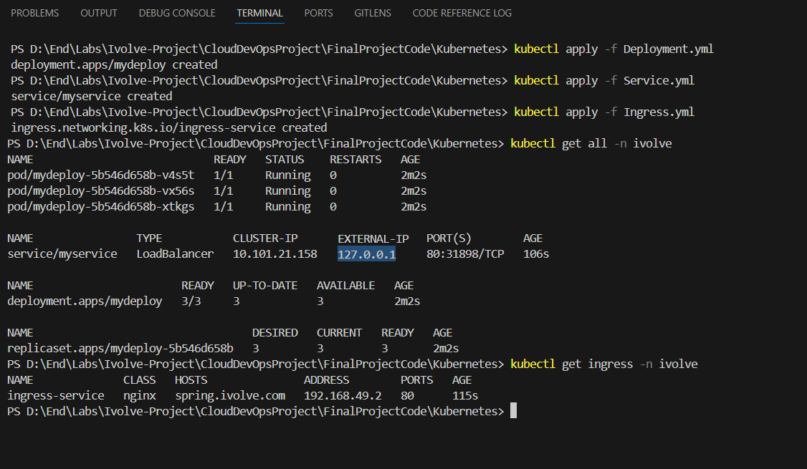
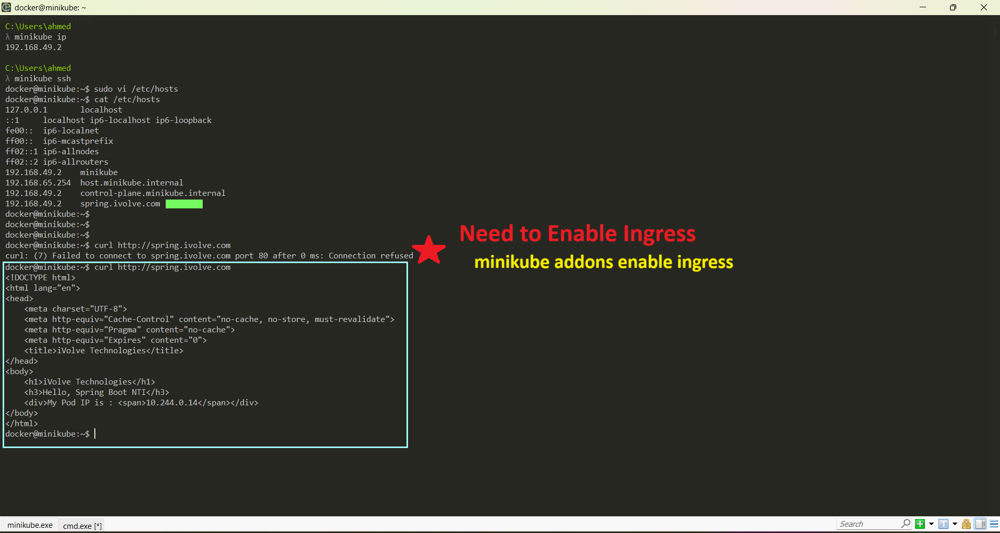

# ☸️ Kubernetes Deployment Guide

This guide provides a professional, step-by-step walkthrough for deploying your Spring Boot application using Kubernetes with Minikube. Learn how to configure namespaces, apply manifests, expose services, and test ingress locally.

---

## 📌 Overview

This section demonstrates a local deployment process on Minikube using the following components:

- **Namespaces**
- **Deployment, Service, and Ingress Manifests**
- **LoadBalancer & Port Forwarding**
- **Ingress Controller & Hostname Mapping**


---

## 🛠️ Configure Kubernetes & Minikube

1. **Start Minikube and Create a Namespace:**

```bash
minikube start           # Start your local Kubernetes cluster
minikube status          # Verify that Minikube is running

kubectl create namespace ivolve   # Create a dedicated namespace
kubectl get ns                    # Confirm creation
```


---

## 📄 Apply Kubernetes Manifest Files

Apply your deployment, service, and ingress manifests into the cluster:

```bash
kubectl apply -f Deployment.yml
kubectl apply -f Service.yml
kubectl apply -f Ingress.yml

minikube tunnel                # Enable external access (LoadBalancer)
kubectl get all -n ivolve      # Verify resources are running
kubectl get ingress -n ivolve  # View ingress info
```




---

## 🔌 Accessing the Application via Service

You can also use `kubectl port-forward` to expose your service manually:

```bash
kubectl port-forward service/myservice 7000:80 -n ivolve
```

  


---

## 🌐 Accessing the Application via Ingress

1. **Enable and Access via Ingress:**

```bash
minikube ip         # Get your Minikube cluster IP
minikube ssh        # (Optional) SSH into the VM

# Edit local /etc/hosts to map domain name to Minikube IP
sudo vi /etc/hosts
# Example entry:
# 192.168.49.2   spring.ivolve.com

# Test access
curl http://spring.ivolve.com
```

2. **Troubleshooting Tip:**

If ingress doesn't work initially, make sure the ingress addon is enabled:
```bash
minikube addons enable ingress
```



---

🎉 You're now running a fully functional Kubernetes environment with Minikube! Be sure to customize your YAML files and ingress domain for production use.

