# 🌍 Terraform Infrastructure as Code Deployment

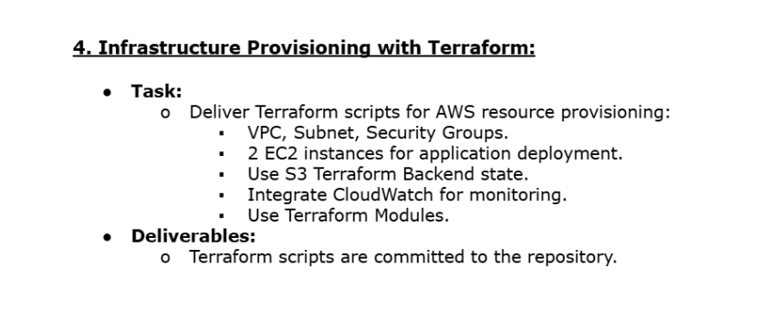

---

## 📚 Table of Contents
- [🌍 Terraform Infrastructure as Code Deployment](#-terraform-infrastructure-as-code-deployment)
  - [📚 Table of Contents](#-table-of-contents)
  - [🧠 What is Infrastructure as Code (IaC)?](#-what-is-infrastructure-as-code-iac)
    - [🚀 Why IaC is Important:](#-why-iac-is-important)
  - [📋 Prerequisites](#-prerequisites)
  - [🧱 Project Architecture](#-project-architecture)
  - [🪣 S3 Bucket Setup for Backend](#-s3-bucket-setup-for-backend)
  - [🚀 Running Terraform Commands](#-running-terraform-commands)
  - [⚙️ Module Preparation: VPC, EC2, Security Groups, CloudWatch](#️-module-preparation-vpc-ec2-security-groups-cloudwatch)
  - [📁 Directory Structure](#-directory-structure)
  - [📈 Terraform Apply Output](#-terraform-apply-output)
  - [🌐 Infrastructure Outputs](#-infrastructure-outputs)
    - [🌍 VPC](#-vpc)
    - [🖥️ EC2 Instances (Master \& Slave)](#️-ec2-instances-master--slave)
    - [🔐 Security Group](#-security-group)
    - [🔑 Key Pair](#-key-pair)
    - [📡 CloudWatch Monitoring](#-cloudwatch-monitoring)
    - [📨 SNS Topic \& Email Alerts](#-sns-topic--email-alerts)
    - [🗃️ Terraform State File in S3](#️-terraform-state-file-in-s3)
  - [🏗️ Alternative Structure: High Availability](#️-alternative-structure-high-availability)
  - [🙋‍♂️ Need Help?](#️-need-help)

---

## 🧠 What is Infrastructure as Code (IaC)?


**Infrastructure as Code (IaC)** is a modern DevOps practice that enables you to define and manage your infrastructure using configuration files written in human-readable formats (like **Terraform's HCL**). Instead of manually configuring servers or networking components, IaC automates the entire provisioning process. 🔄

### 🚀 Why IaC is Important:

- ✅ **Consistency**: Eliminates human error by applying the same configuration every time.
- ⚡ **Speed & Efficiency**: Deploy infrastructure in minutes, not hours or days.
- 🔄 **Version Control**: Store and track infrastructure changes just like application code.
- 📦 **Reusability**: Create modular and reusable components for different environments (dev, staging, production).
- 🛡️ **Disaster Recovery**: Easily rebuild infrastructure from source code after failures.

IaC empowers teams to build **reliable**, **repeatable**, and **scalable** cloud environments — essential for modern cloud-native applications.

---

## 📋 Prerequisites

Ensure the following tools are installed and configured:

```bash
🔧 Install Terraform:
https://developer.hashicorp.com/terraform/install

✅ After downloading the .zip file and extracting it, add terraform.exe to your system PATH.
Check installation:
terraform --version

☁️ Install AWS CLI:
https://docs.aws.amazon.com/cli/latest/userguide/getting-started-install.html

Check installation:
aws --version

🔐 Configure AWS credentials:
aws configure
```

---

## 🧱 Project Architecture

This structure is designed for **cost-effectiveness** and **low latency** by deploying two EC2 instances in the **same subnet** within a **single Availability Zone (AZ)**.

```bash
🧠 For high availability and fault tolerance architecture, refer to the section "Alternative Structure" below.
```

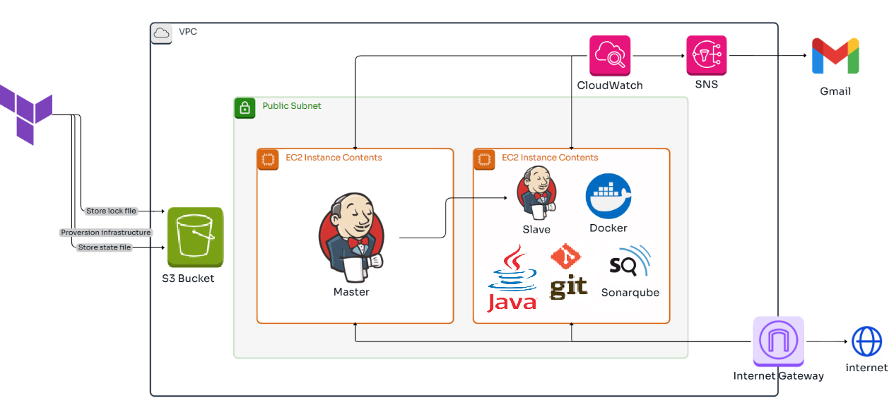

---


---

## 🪣 S3 Bucket Setup for Backend

```bash
# Create an S3 bucket via AWS CLI:
aws s3api create-bucket --bucket ivolve-s3-ahmedbdelhamid --region us-east-1

# Verify bucket creation:
aws s3 ls
```

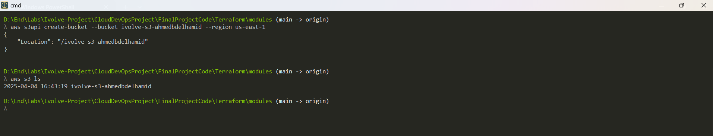
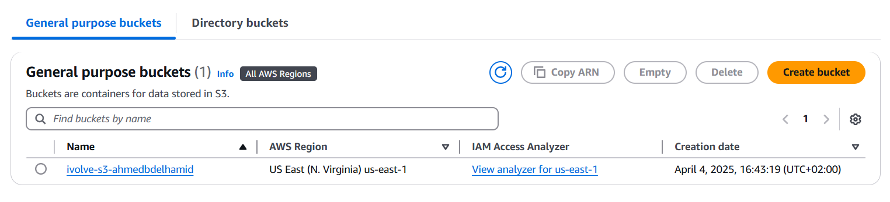

---

## 🚀 Running Terraform Commands

```bash
1️⃣ Initialize the working directory & install Plugins:
terraform init

2️⃣ Format configuration files:
terraform fmt

3️⃣ Validate configuration:
terraform validate

4️⃣ Preview infrastructure changes:
terraform plan

5️⃣ Apply the configuration:
terraform apply -auto-approve
```

---

## ⚙️ Module Preparation: VPC, EC2, Security Groups, CloudWatch

Each module includes:

```bash
📄 main.tf
📄 variables.tf
📄 outputs.tf
```

## 📁 Directory Structure

```
terraform-project/
├── modules/
│   ├── vpc/               # Virtual Private Cloud
│   ├── ec2/               # EC2 Instances
│   ├── security_groups/   # Security Group Rules
│   └── cloudwatch/        # Monitoring
├── main.tf                # Root Module
├── provider.tf            # Provider Block
├── variables.tf           # Input Variables
├── outputs.tf             # Outputs
├── SNS.tf                 # Notifications
├── Key.Pair.tf            # EC2 SSH Key Pair
├── backend.tf             # S3 Backend
```

---

## 📈 Terraform Apply Output

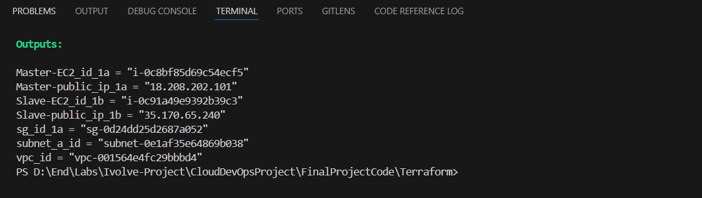

---

## 🌐 Infrastructure Outputs

### 🌍 VPC

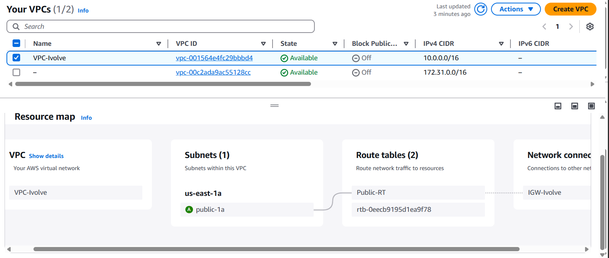

### 🖥️ EC2 Instances (Master & Slave)

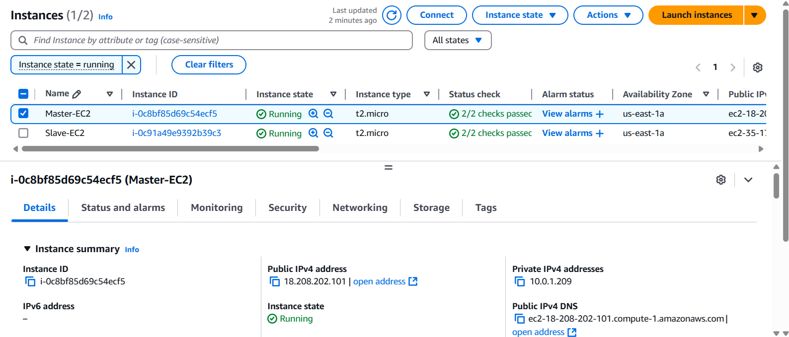
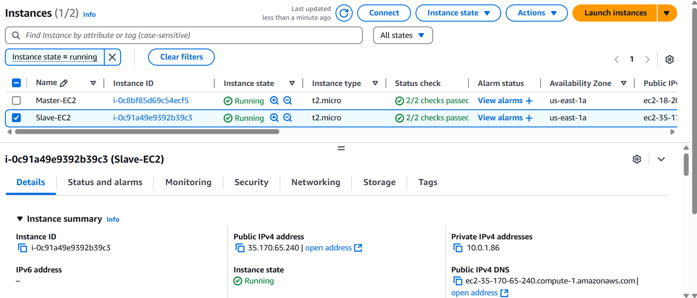

### 🔐 Security Group

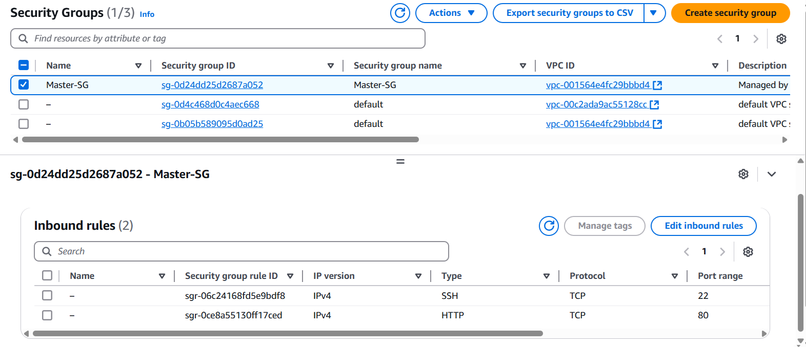

### 🔑 Key Pair


### 📡 CloudWatch Monitoring

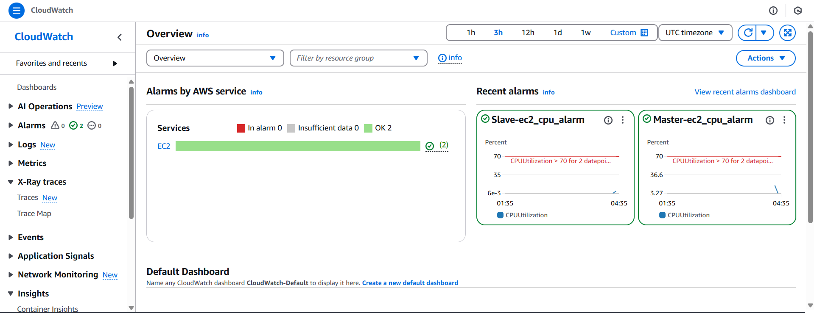

### 📨 SNS Topic & Email Alerts

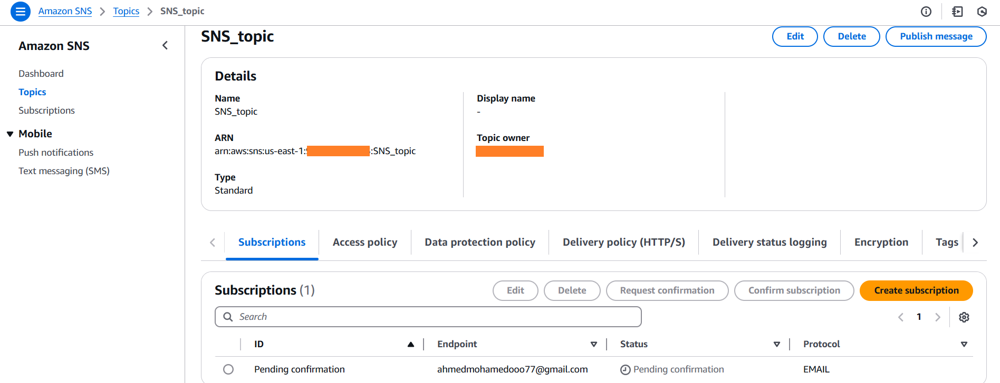
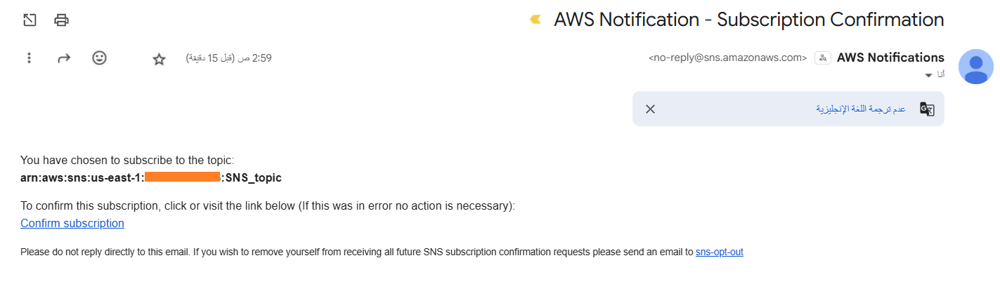

### 🗃️ Terraform State File in S3

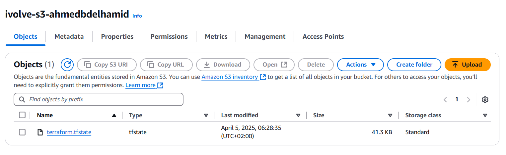

---

## 🏗️ Alternative Structure: High Availability

For enhanced **fault tolerance** and **redundancy**, use this setup which places EC2 instances in **separate subnets** across **different AZs**.

```bash
🔄 To switch to this structure, uncomment the related code blocks in the Terraform configuration files.
```

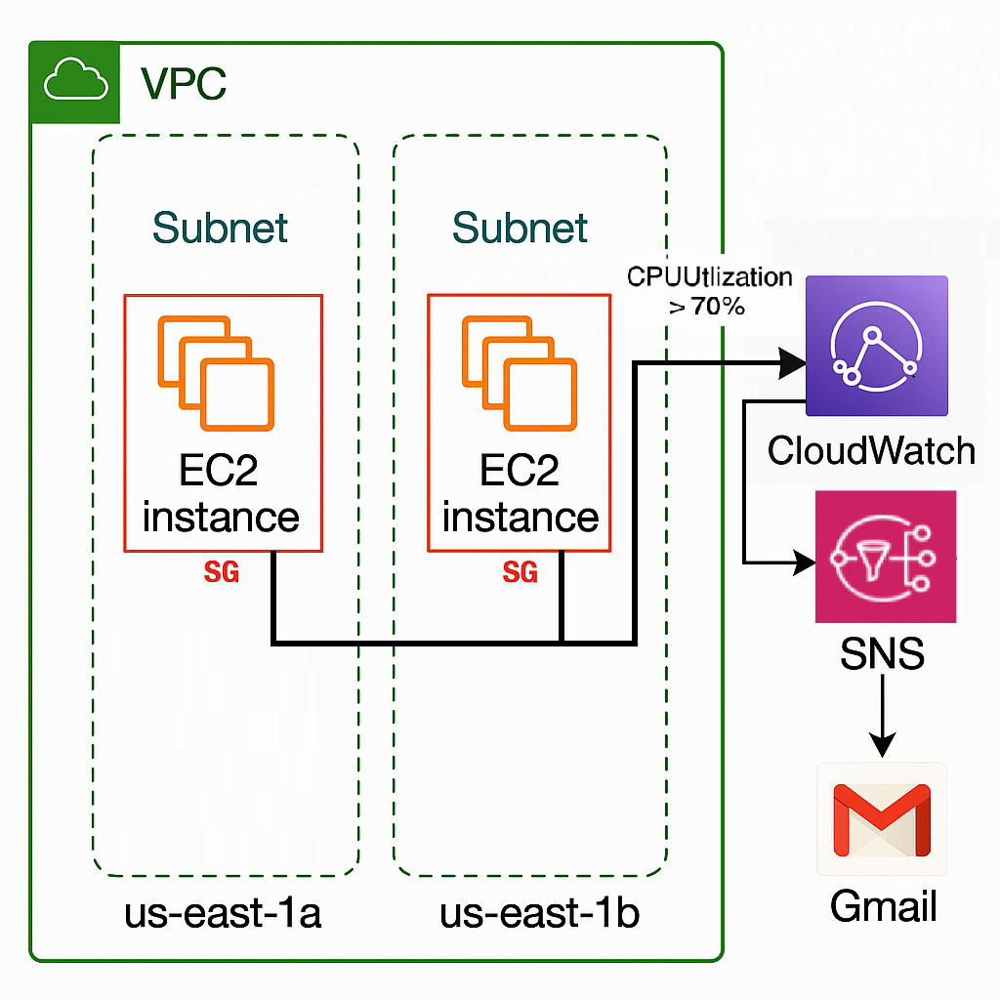

---

## 🙋‍♂️ Need Help?

```bash
💬 Feel free to reach out with any questions or suggestions.
```