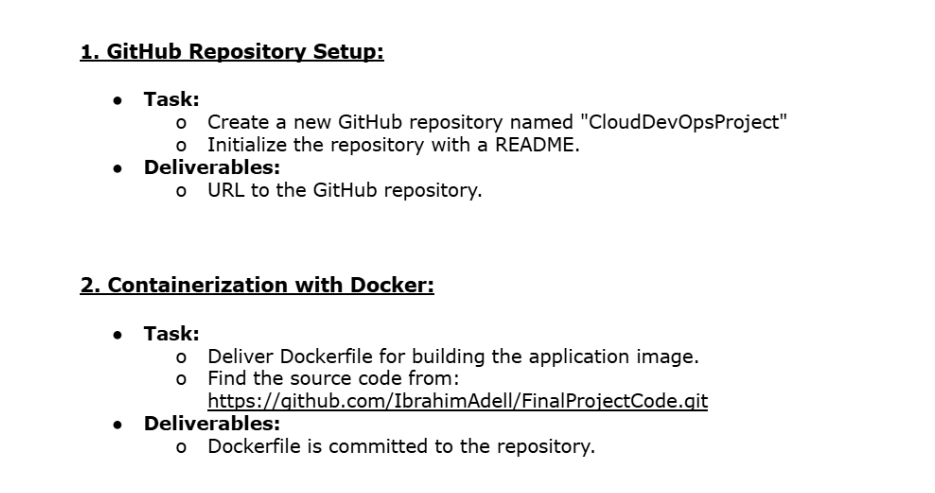
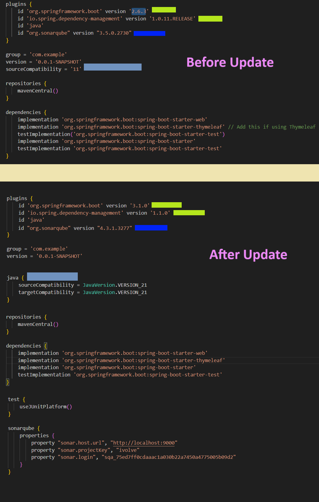
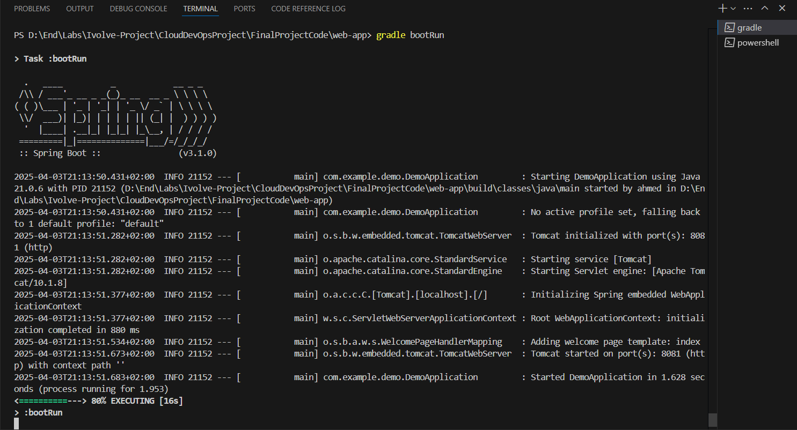
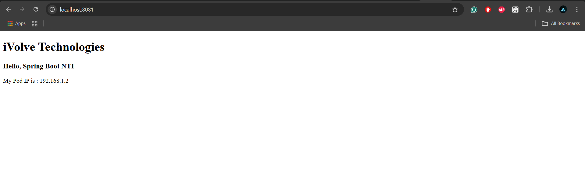
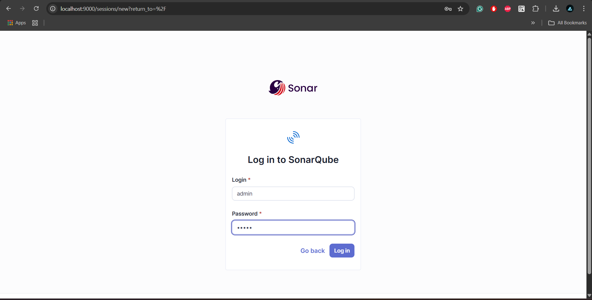
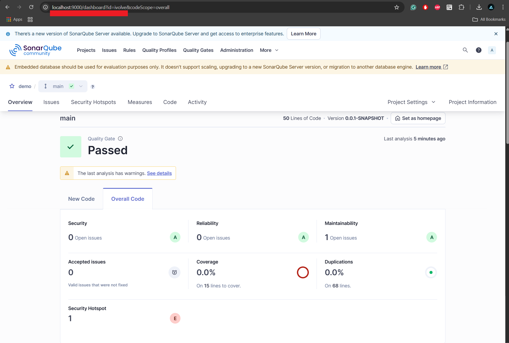
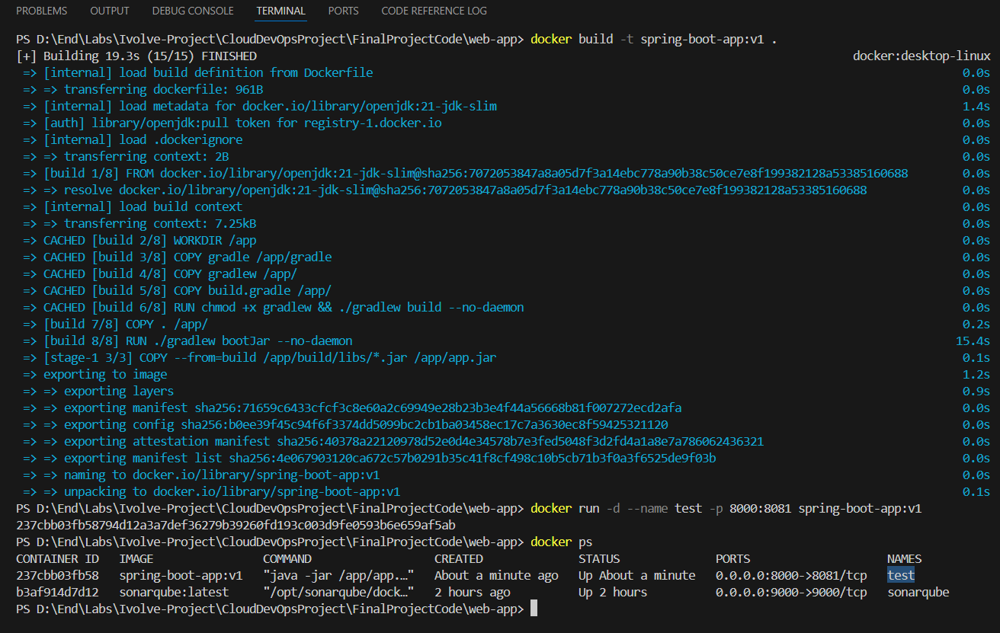
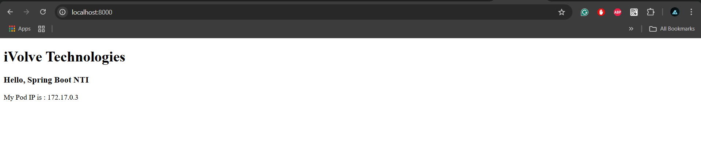
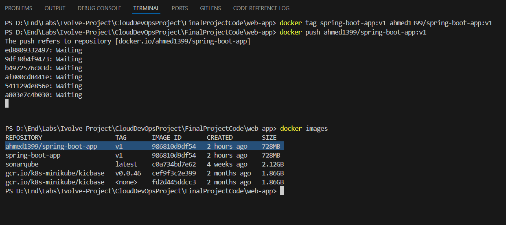

# 🚀 Spring Boot Project - Local Development Guide

Welcome to the Spring Boot project! This document outlines the steps to set up, run, and deploy the project locally. Follow the instructions below to clone the repository, install the required tools, run the application, perform code scanning, and build and deploy a Docker image.

---

## 📚 Table of Contents

- [Project Overview](#project-overview)
- [Prerequisites](#prerequisites)
- [Cloning the Repository](#cloning-the-repository)
- [Setting Up the Environment](#setting-up-the-environment)
- [Running the Application](#running-the-application)
- [Code Quality and Scanning](#code-quality-and-scanning)
- [Docker Integration](#docker-integration)
- [Tag & Push Docker Image](#tag--push-docker-image)
- [Troubleshooting & Notes](#troubleshooting--notes)

---

## 📝 Project Overview

This repository contains a Spring Boot project with integrated Gradle build scripts, Docker configurations, and SonarQube setup for code quality scanning. The goal is to provide a robust local development environment that simulates production-like scenarios.



---

## ⚙️ Prerequisites

Before proceeding, ensure you have the following installed on your system:

- **Java JDK 21**  
  [Download JDK 21 for Windows](https://www.oracle.com/java/technologies/downloads/?er=221886#jdk21-windows)  
  *Add the Java path (e.g., `C:\Program Files\Java\jdk-21`) to your system environment variables and verify using:*
  ```bash
  java --version
  ```

- **Chocolatey Package Manager** (for Windows)  
  Install Chocolatey using PowerShell (Run as Administrator):
  ```bash
  Set-ExecutionPolicy Bypass -Scope Process -Force; [System.Net.ServicePointManager]::SecurityProtocol = [System.Net.ServicePointManager]::SecurityProtocol -bor 3072; iex ((New-Object System.Net.WebClient).DownloadString('https://community.chocolatey.org/install.ps1'))
  ```
  Verify installation:
  ```bash
  choco -v
  ```

- **Gradle**  
  Install Gradle using Chocolatey:
  ```bash
  choco install gradle -y
  ```
  Verify installation:
  ```bash
  gradle -v
  ```

---

## 📅 Cloning the Repository

Clone the project repository to your local machine:
```bash
git clone https://github.com/IbrahimAdell/FinalProjectCode.git
```

---

## 💠 Setting Up the Environment

After cloning the repository, navigate to the project directory and adjust configurations as needed.

1. **Navigate to the Project Directory:**
   ```bash
   cd FinalProjectCode/web-app
   ```

2. **Update `build.gradle`:**
   - Update versions for dependencies such as `org.springframework.boot`, `io.spring.dependency-management`, and `org.sonarqube`.
   - Remove any redundant configurations.
   - Set `sourceCompatibility` and `targetCompatibility` to be compatible with Java JDK 21.
   - Configure the SonarQube properties for code scanning.
  
   

---

## ▶️ Running the Application

1. **Update the Gradle Wrapper:**

   Open `web-app/gradle/wrapper/gradle-wrapper.properties` and update the distribution URL:
   ```properties
   distributionUrl=https\://services.gradle.org/distributions/gradle-8.13-bin.zip
   ```
   Then, run:
   ```bash
   gradle wrapper --gradle-version 8.13
   ```

2. **Build and Run:**
   ```bash
   gradle build
   gradle bootRun
   ```
   Access the application at: [http://localhost:8081](http://localhost:8081)

     
   

---

## 🔍 Code Quality and Scanning

**SonarQube** is used to scan the project code. Follow these steps to run SonarQube:

1. **Start SonarQube via Docker:**
   ```bash
   docker run -d --name sonarqube -p 9000:9000 sonarqube:latest
   docker ps
   ```
2. **Access SonarQube in your Browser:**
   [http://localhost:9000](http://localhost:9000)

3. **Generate a SonarQube Token:**
   - Click on the User Icon (top-right) → My Account → Security.
   - Generate a token (e.g., `gradle-token`) and save it for later configuration.

4. **Configure SonarQube in `build.gradle`:**
   ```groovy
   property "sonar.login", "<Your-Token>"
   ```

5. **Run the SonarQube Scan:**
   ```bash
   ./gradlew sonar
   ```
   View the scan results at: [http://localhost:9000/dashboard?id=ivolve](http://localhost:9000/dashboard?id=ivolve)

     
   

---

## 🏗️ Docker Integration

Build and run your Spring Boot application inside a Docker container.

1. **Fix the Main Class Issue:**

   Navigate to your main application file and ensure `build.gradle` includes:
   ```groovy
   springBoot {
       mainClass = 'com.example.demo.DemoApplication'
   }
   ```

2. **Build the Docker Image:**
   ```bash
   docker build -t spring-boot-app:v1 .
   ```

3. **Run the Docker Container:**
   ```bash
   docker run -d --name test -p 8000:8081 spring-boot-app:v1
   ```
   
     
   

---

## 📄 Tag & Push Docker Image

1. **Log in to Docker Hub:**
   ```bash
   docker login
   ```

2. **Tag the Docker Image:**
   ```bash
   docker tag spring-boot-app:v1 ahmed1399/spring-boot-app:v1
   ```

3. **Push the Image to Docker Hub:**
   ```bash
   docker push ahmed1399/spring-boot-app:v1
   ```
   
   

---

## ❓ Troubleshooting & Notes

- **Gradle Wrapper Issues:** Ensure you update the Gradle version in `gradle-wrapper.properties` if you face version conflicts.
- **SonarQube Configuration:** Double-check the token and configuration in `build.gradle` if code scanning fails.
- **Docker Build Errors:** Verify the path to your main application class if Docker build issues arise.

---

Happy coding! For any further assistance, please feel free to raise an issue or contact the project maintainers.

